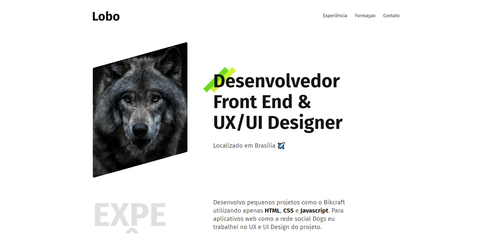

  

# 🐺 Portfolio Lobo
Projeto do curso ProgramadorBR em que aprendi a desenvolver a lógica por trás do jogo da memória, dessa vez refatorado/atualizado para React.

## ⚙️ Funcionalidades

- [x] Portfolio com design simples utilizando conceitos de Ui Design;
- [x] Totalmente responsivo e intuitivo;
- [x] Ao clicar no menu é derecionado a área respectiva do site;

## 🚀 Tecnologias

- [HTML](https://www.w3schools.com/html/)
- [CSS](https://developer.mozilla.org/pt-BR/docs/Web/CSS)
- [JavaScript](https://developer.mozilla.org/pt-BR/docs/Web/JavaScript)

## 📝 Considerações
Projeto simples apenas para treinar meus conhecimentos em HTML e CSS;
